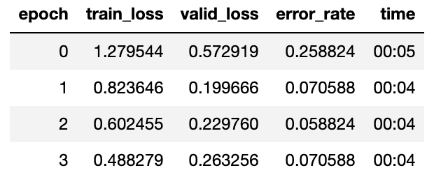

# Coral Vs King Snake Classifier

This project creates an image classifier that can distinguish deadly coral snakes ([Micrurus tener](https://en.wikipedia.org/wiki/Micrurus_tener)) from harmless king snakes ([scarlet kingsnake](https://en.wikipedia.org/wiki/Scarlet_kingsnake)). The project is based on information from the first few lessons in the [2019 Fast.ai MOOC](https://course.fast.ai/)

## Images

I harvested 233 images of coral snakes, and 193 images of king snakes using Google, Bing and Flickr image search engines with help from the [FastClass](https://github.com/cwerner/fastclass) utility program. Along the way I added Flickr support to the FastClass and PR'ed my addition back to cwerner's project.

FastClass fits rectangular images into a square, and fills the gap with white. I felt that the start white padding was hurting my results. So I added the ability to not pad the images to fit in a square, and instead keet them rectangular. This way I can let fast.ai's transformations do their thing picking random crops and filling in gaps with reflections of the image instead of solid colors. If I really needed to I could crop square images manually to keep the main subject in frame. I did not PR that code back to the main repo because of merge conflicts.

## Training

Look at snakes.py (or \_snakes.ipynb which is derived from snakes.py) to see how I created the model. I created a resnet34 pretrained model, split the images into 80% training, 20% validation, applied default image transformations, and trained with `fit_one_cycle` for 4 epochs. XXXRESULTS.

Next I used unfroze the model, used the learning rate finder and a few iterations of trial and error to settle on a max learning rate of `slice(1e-4,3e-4)` (keeping the recommended 3e-4 rate for the later layers). I ran another 4 epochs using this new learning rate rate on the unfrozen model. XXXRESULTS.

- results
- screenshots

## Web Wrapper for Trained Model

- other guy's starlette app as starting point
- export/load is new way
- 87 mb file
- Python Starlette on top of uvicorn server. Can upload file or url to perform prediction, send results as JSON. Minimal html page.

## Docker for Python

- fastai won't install on mac
- docker works great
- multistage dockerfile for local dev vs slimmed down production image
- compose to easily launch containers. I don't use for multi containers simultaneously, I really use it as a way to not have to type out docker run --lotsofopts
- VScode docker extension is great. Connect to running container so the libs within the container are used for VScode intellisense and Jupyter notebooks work (but things widgets don't work, like doc()). Vs-code specific compose file to tweak settings.
- Zeit / now.sh / Vercel doesn't support docker anymore.
- Heroku supports docker. Initial image was 3GB! I moved to a multistage build to separate building pip libs from the compiled libs. Cpu only version of pytorch saves about 1 GB. Separate dev goodies out to separate image. Image is stil gigantic (1GB). Fortunately heroku doesn't have a hard size limit.
- docker history helped me see what added what.
- Apline linux sounds nice but doesn't work with pytorch and vscode.
- DataLoader with lots of images will crash with default settings. Either use just one worker, or increase the /dev/shm limit when creating the container. `run XXX --shm-size=2g”
- Docker desktop for Mac has additional resource limits by default. I bumped up the memory and cpus. Requires a container restart.

## Deploy Python Backend to Heroku

- Heroku’s `container:push` doesn’t understand compose, nor can I find a way to tell it which build target within the Dockerfile to use, so it pushes all the images combined!
- The solution appears to be to build the image myself using compose, then push the image to heroku “manually”. The correct naming scheme must be followed. https://devcenter.heroku.com/articles/container-registry-and-runtime#pushing-an-existing-image
- One time setup
  heroku create
  heroku auth:token | docker login --username=\_ --password-stdin registry.heroku.com
- every time steps
  compose build web
  docker tag snakes_web:latest registry.heroku.com/glacial-anchorage-17811/web
  docker push registry.heroku.com/glacial-anchorage-17811/web
  heroku container:release web

## Deploy JS Frontend to Heroku

- install herok CLI. https://devcenter.heroku.com/articles/heroku-cli
- heroku create
- heroku config:add BACKEND_URL=https://snakes-api.herokuapp.com
  - NO final /
- git push heroku

## Deploy JS Frontend to Vercel

- formerly Zeit / Now.sh
- install Vercel CLI https://vercel.com/download
- vercel --build-env BACKEND_URL=https://snakes-api.herokuapp.com

## VSCode

- motivation
- docker & compose
- extensions
- jupyter vs #%% in .py files. Convert.
- doc() doesn't work

## Demo

- link to demo site

testing image 
