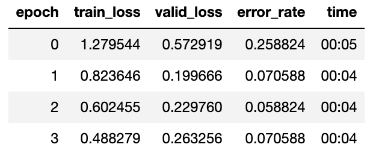
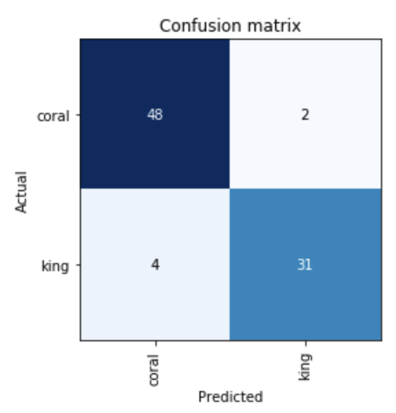
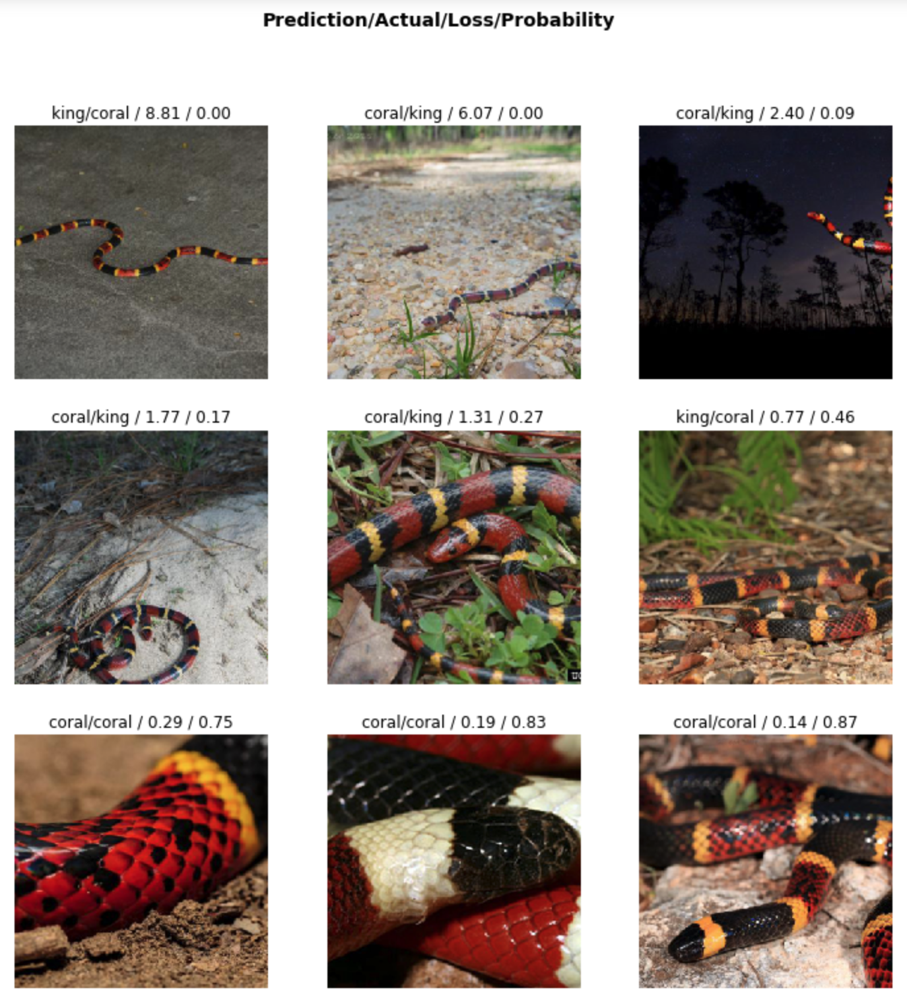
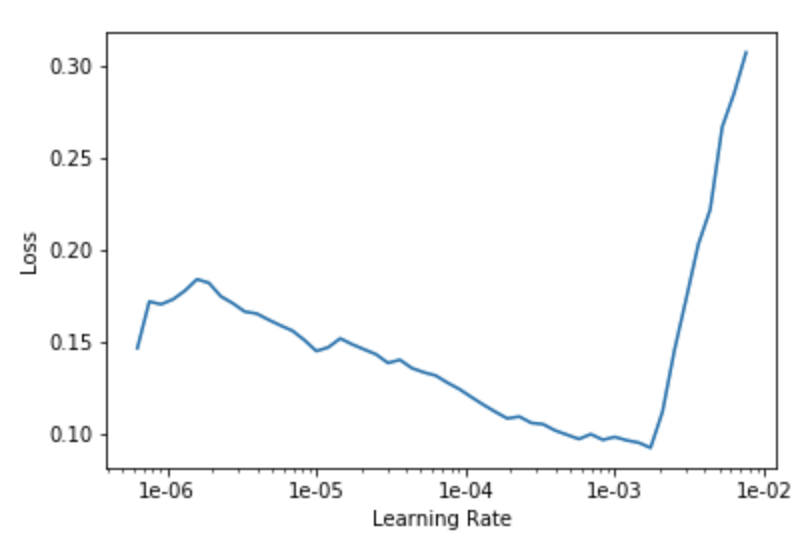
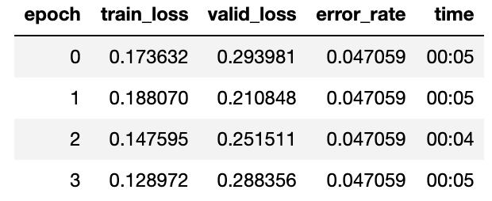
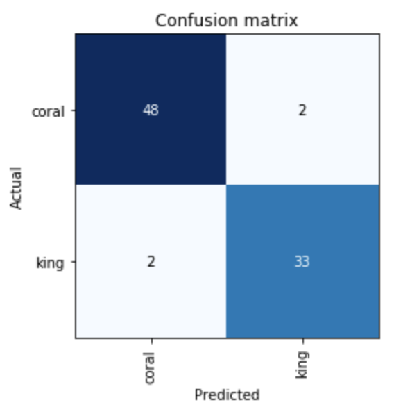
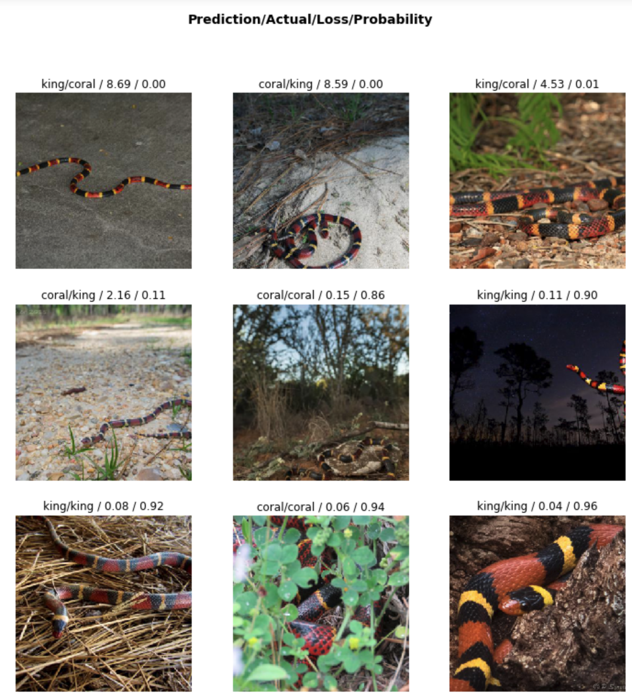

# Training The Model

*Note: this goes into a lot of small details because it's mostly for my future self and to help remind me why it took so long to get this project working. I'm writing it ~2 weeks after I did the work so some of the details are likely incorrect.*

Getting a good dataset was the hardest part of this whole project! Sure, I could have used an existing dataset but that didn't seem satisfying. The [2019 lesson 2 notebook](https://nbviewer.jupyter.org/github/fastai/course-v3/blob/master/nbs/dl1/lesson2-download.ipynb) and discussion forum described several ways to harvest images from Google Images, but I ran into lots problems getting any of those to work well. Perhaps it was due to popup blockers, chrome security constantly getting tighter, or Google Images changes their html.

## Picking a Topic

I was inspired by one project that only used 30 images to train a baseball vs cricket classifier. So I set off to collect 30 or so images. I picked the topic of "80s vs 90s clothing style" based on a silly discussion in the prior weeks. I manually dragged a bunch of images from search results into 2 folders. I ran that through the model... and got poor results. Something like 70-75% accuracy. I didn't like the fact that my validation set of 20% meant only 7 actual images. It felt too contrived. Plus the more I looked at the images I realized I couldn't tell what decade a lot of them were. Who knows if the source was even correct. Or maybe there was a lot of overlap in styles in the late 80s and early 90s.

So I picked a new topic that felt hard enough but not too hard. Coral vs King snake classifier. As a child I learned a mnemonic to tell the deadly vs harmless snakes apart: "red and yellow kill a fellow, red and black friend of jack". They often have bands of the same color, but in a different patter. My initial search was a bit of a mess. I learned there are several species of each snake that share those common names. I picked on species from each category and searched using the latin name. For the coral snake I added `-king` to the query because many articles talk about both snakes. The king snake query didn't need that modification.

## Initial Images

I used some kind of script to grab about 75 images from each group. Then I used Finder to manually weed out bad images from each group, resulting in about 50 images per class. I ran that through the training process and got ok results but still not as good as I expected - about 80% accuracy. I had a hunch that I just needed more data.

I decided to up my image harvesting game. I downloaded the [FastClass](https://github.com/cwerner/fastclass) utility program that was written by a student the previous year. It worked pretty well, and I liked how it got images from Bing in addition to Google. I got about 150 images for each class and trained on that, resulting in about 90% accuracy. Better, but I still felt I needed more data.

I experimented with Flickr search I felt the image quality and variety was excellent compared to Google and Bing. So I decided to tinker with FastClass to add support for Flickr images. 

## FastClass Harvester Tangent

I barely knew any Python, and up to this point I had only used python in [Jupyter](https://jupyter.org/) notebooks on a remote server. The first step was getting FastClass working on my desktop computer.

I cloned the repo and got [VS Code](https://code.visualstudio.com/) spiffed up with Python extensions for syntax highlighting, intellisense, linting, code formatting, etc. I `brew install`'ed a non-ancient version of Python and learned how to download python dependencies with [pip](https://pypi.org/project/pip/). I discovered that `brew install` is frowned upon and instead some kind of virtualization is recommended. So I switched to [pyenv](https://github.com/pyenv/pyenv), which lets each project use it's own version of python, and not clobber the system version. Pyenv is a lot like [rbenv](https://github.com/rbenv/rbenv) that I've used for years with Ruby, so it was easy to figure out.

After a deep dive I got Flickr added to FastClass. I thought it was pretty useful so I pull-requested my new feature back to cwerner's project. It was accepted, but I learned that the formatter I used changed a ton of code spacing and whatnot, and that can be pretty annoying. Fortunately it wasn't hard for cwerner to apply his own formatter to change it all back as part of the pull request. Cwerner uses the [black](https://github.com/psf/black) formatter, so I took and I felt it produced nicer looking output so I changed my settings.

Along the way I realized FastClass fits rectangular images into a square shape, and fills the gap with white. Square images are easier for training, so it makes sense to square them. But I remembered the instructor talking about how padding with a solid color is less good than mirroring the image, so I wondered if that the stark white padding was hurting my results. 

I perused the Fast.ai docs and saw that fast.ai will automatically do random crops into the image and apply the mirror effect as needed. It also does all kinds of other transformations on images such as stretching, messing with brightness and contrast, rotations, etc. These are called *augmentations*, and are a recommended technique to avoid overtraining on the exact pixels and force generalization. Augmentations are applied to the original images on *every* epoch, so each round of learing sees slightly different variations of the same image.

So I dug into the FastClass code and added the ability to *not* pad the images, nor try to fit into a square. Instead the images are kept rectangular, proportionally resized with the longer size conforming to the `size` setting. This way I can let fast.ai's transformations do their thing on the fly to create augmented square images on the fly. I figured I really needed to I could crop square images manually to keep the main subject in frame. I did not PR that code back to the main repo because of merge conflicts, and I'm not sure if anyone else thinks this feature is useful. Ideally I would run some tests to compare white padded square crops vs rectangular images. But that would be yet another tangent.

Whew. Finally I could get back to actually harvesting images.

## Final Image Set

I created a [CSV](../training/images/snakes.csv) with my search queries and fired up the new and improved FastClass downloader.

```console
FLICKR_API_KEY=blahblahblah fcd -c GOOGLE -c BING -c FLICKR -m 500 -s 500 -p snakes.csv
```

I used a size of 500 (`-s 500`) because images will be further cropped by fast.ai to become 229 or 299 or whatever and I didn't want any upsampling. I asked for 500 images from each provider (`-m 500`) but I didn't get anywhere near that. It was closer to about 250 total images for each class.

Next I used Finder to manually delete irrelevant images. Some snakes in each category look different than the "classic" red/yellow/black banding, but I decided to keep most of them because I figured they are representative of real world snakes. Of course I could be wrong, maybe they are different species. I didn't dig that deep into the domain knowledge.

In the end I came up with 233 images of coral snakes and 193 images of king snakes.

## Training

Look at [snakes.py](../code/snakes.py) to see how I created the model. (Or alternatively [_snakes.ipynb](../code/_snakes.ipynb) which is derived from snakes.py but is possibly out of date and missing nice outputs).

The starting model is a resnet34 model pretrained on [ImageNet](http://www.image-net.org/) data. The images are split into 80% training, 20% validation, with default image transformations that produce 299x299 images.

### Stage 1

Next the model is trained in a "frozen" state, meaning only the last layer gets modified. I found that `fit_one_cycle` for 4 epochs produced decent results, resulting in 93% accuracy (= 7% error).

<div></div>

Only 6 out of 85 images are misclassified.

<div></div>

Top losses: the images where the model scored the worst. 6 are incorrectly classified, the remaining 3 are correct but the model was not very confident.

<div></div>

### Stage 2

Next I unfroze the model so that learning applied to all layers. I performed a few iterations with the learning rate finder tool. I picked a max learning rate of `1e-4` for the early layers, and kept the recommended `3e-4` rate for the final layers. 

<div></div>

I ran another 4 epochs using this new learning rate rate on the unfrozen model. It's get better than 5% accuracy on the first round. But it looks like the model is overfitting because while the train_loss gets better, the valid_loss gets worse starting on epoch 2.

<div></div>

At this point the model is only getting 4 out of 85 images wrong.

<div></div>

<div></div>


### Model Export

Exporting the trained model is an simple one-liner. The result is a single file just shy of 90 MB. I use this exported model in the [backend server](backend.md) to expose an API for web based inferences.
